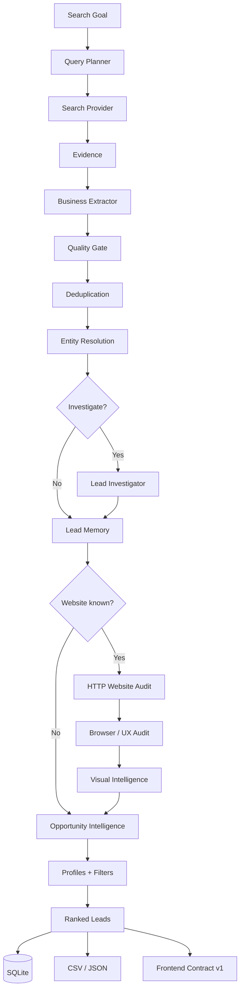

<div align="center">

# LeadFlow Agent

### Evidence-driven lead research, qualification and digital opportunity intelligence.

**Local-first · BYOK · Open source · Explainable scoring · Security-aware**


**Current version:** `0.1.4.dev0`
**Next milestone:** `v0.2.0-alpha — Backend Intelligence Core`

</div>

---

## What is LeadFlow?

LeadFlow is an open-source **lead research and opportunity intelligence agent** designed to find real businesses, investigate them, verify evidence, audit their digital presence and explain **why a company may be a strong commercial opportunity**.

It is not a static lead database and it does not assume that one search result equals one company.

LeadFlow works more like a research analyst:

```text
Goal
  ↓
Plan search queries
  ↓
Search public evidence
  ↓
Extract real businesses
  ↓
Deduplicate + resolve identity
  ↓
Investigate uncertain data
  ↓
Audit website / browser UX / visual quality
  ↓
Classify opportunity
  ↓
Rank + explain + persist
```

The project started from a practical problem: manually prospecting local businesses for web-development services. It has evolved into a more general foundation for discovering **digital-service opportunities**.

> **Core safety rule:** false association is worse than missing information.

If LeadFlow is unsure whether a website, phone number or social profile really belongs to the intended company, it prefers to keep the field unresolved instead of attaching potentially wrong data.

---

## Why LeadFlow is different

Traditional lead scrapers often optimize for quantity. LeadFlow is being built around **evidence quality, identity safety and commercial context**.

| Traditional approach | LeadFlow |
|---|---|
| Search result = lead | Search result = evidence |
| Missing website = automatically good lead | Website state must be investigated |
| Same business name = same company | Identity requires corroborating evidence |
| One generic score | Separate identity, technical, UX, visual and opportunity signals |
| Re-search everything | Persistent cache + business memory |
| Provider failures crash the run | Retries, budgets, circuit breakers and partial completion |
| Fixed lead criteria | Search profiles + advanced filters |
| Provider-specific business logic | Provider capability architecture |

---

## Project status

LeadFlow is currently a **CLI-first alpha**. The backend intelligence core is close to its first public checkpoint.

### Backend Intelligence Core

| Capability | Status |
|---|:---:|
| Search planning | ✅ |
| Web discovery | ✅ |
| Structured business extraction | ✅ |
| Deduplication | ✅ |
| Conservative entity resolution | ✅ |
| Lead Investigator | ✅ |
| Persistent search cache | ✅ |
| Persistent lead memory | ✅ |
| Data-quality guardrails | ✅ |
| Website technical audit | ✅ |
| Browser / mobile UX audit | ✅ |
| Screenshot generation | ✅ |
| Multimodal visual intelligence | ✅ |
| Opportunity Intelligence | ✅ |
| Search profiles | ✅ |
| Advanced filters | ✅ |
| Runtime budgets | ✅ |
| Circuit breakers | ✅ |
| Cancellation hooks | ✅ |
| Provider capability registry | ✅ |
| Security boundaries | ✅ |
| Versioned SQLite migrations | ✅ |
| Stable frontend contract | ✅ |
| GUI | 🔜 Next |
| Login / cloud accounts | 🕒 Later |
| Billing / subscriptions | 🕒 Later |
| Automated outreach | 🕒 Later |

---

## Architecture



### Architectural principles

- **Evidence before assumptions** — external search data is treated as evidence, not truth.
- **Identity before enrichment** — a candidate field is not attached until it plausibly belongs to the same business.
- **Independent intelligence layers** — technical health, browser UX, visual quality and commercial opportunity remain separate.
- **Local-first** — research state lives locally in SQLite unless future cloud features are explicitly enabled.
- **BYOK** — users bring their own provider credentials.
- **Bounded execution** — agents operate inside explicit runtime budgets.
- **Provider portability** — business logic depends on capabilities, not one vendor.
- **Safe failure** — partial useful results are preferable to runaway retries or hard crashes.

---

## Intelligence layers

LeadFlow intentionally avoids collapsing everything into one misleading score.

### 1. Identity Confidence

Answers:

> **Are these details really about the same business?**

Identity states:

```text
UNVERIFIED
MATCHED
PROBABLE_MATCH
AMBIGUOUS
MISMATCH
```

Strong signals include normalized phone numbers, domains and consistent social/business evidence. Same name alone is not enough.

---

### 2. Website Technical Health

The HTTP auditor measures objective website signals such as:

- HTTP response status;
- HTTPS;
- redirects;
- response time;
- `<title>`;
- meta description;
- viewport configuration;
- forms;
- phone links;
- email links;
- WhatsApp links.

This produces a **technical score**, not an SEO score and not an aesthetic judgment.

---

### 3. Browser / UX Health

With the optional Playwright capability, LeadFlow opens the website in a real Chromium browser and can observe:

- mobile horizontal overflow;
- visible contact CTAs;
- WhatsApp / telephone actions;
- basic navigation presence;
- JavaScript/page errors;
- desktop rendering;
- mobile rendering;
- full-page screenshots.

This produces a deterministic **Browser UX score**.

---

### 4. Visual Quality

Desktop and mobile screenshots can optionally be reviewed by a multimodal model.

Visual Intelligence evaluates visible presentation dimensions such as:

- overall presentation;
- desktop quality;
- mobile quality;
- modernity;
- visual hierarchy;
- brand coherence;
- readability;
- visible conversion clarity;
- model confidence.

A visual score is **subjective AI-assisted analysis**. It cannot overwrite HTTP facts, identity evidence or browser measurements.

---

### 5. Opportunity Intelligence

LeadFlow converts verified evidence into an explainable commercial hypothesis.

Current opportunity types:

| Type | Meaning |
|---|---|
| `NEW_SITE` | No official website was identified after bounded investigation |
| `REBUILD` | Existing website has severe availability/technical problems |
| `REDESIGN` | Existing site works but shows strong modernization potential |
| `OPTIMIZATION` | Site has a reasonable base with visible improvement opportunities |
| `REVIEW_NEEDED` | More evidence or human review is required |
| `LOW_OPPORTUNITY` | Current evidence indicates weak fit for the selected goal |

LeadFlow also distinguishes:

```text
READY   → identity confidence is sufficient for action
VERIFY  → review identity/evidence before approaching the business
```

A company with a broken site may be a stronger commercial opportunity than a company with no site at all — but only when LeadFlow has enough confidence that the site really belongs to that company.

---

## Example result

```text
1. [opp 71 | conf 85 | new_site | READY] Example Business
   +55 13 99999-9999 | sem site (verificado)
   Social: https://instagram.com/example
   Identidade: matched (99%) | site: not_found
   Oferta sugerida: new_website
   Opportunity: ausência de site investigada: oportunidade de primeiro site

2. [opp 55 | conf 78 | rebuild | VERIFY] Example Furniture
   https://example.com
   Audit: 15/100 | HTTPS sim
   Browser UX: 100/100
   Visual: 72/100 | confiança 90%
   Oferta sugerida: website_rebuild
   Atenção: verificar identidade antes da abordagem comercial
```

The important part is not only the rank. LeadFlow explains **what it observed, what it inferred and what still needs verification**.

---

## Requirements

### Core

- Python **3.11+**
- SQLite (included with Python)
- API keys only for the providers you choose to use

The core intentionally relies heavily on the Python standard library.

### Optional browser auditing

- Playwright
- Chromium runtime

---

## Installation

From the project directory:

### Windows

```bat
python -m venv .venv
.venv\Scripts\activate
python -m pip install --upgrade pip
python -m pip install -e .
```

### Linux / macOS

```bash
python3 -m venv .venv
source .venv/bin/activate
python -m pip install --upgrade pip
python -m pip install -e .
```

### Browser / UX capability

```bash
python -m pip install -e ".[browser]"
python -m playwright install chromium
```

Playwright is optional. Discovery, entity resolution, investigation, cache, memory and HTTP website auditing can run without it.

---

## Configuration

Run the interactive setup:

```bash
python -m leadflow_agent setup
```

Then verify the environment:

```bash
python -m leadflow_agent doctor
```

Typical configuration:

- Gemini API key;
- Gemini model, currently `gemini-3.1-flash-lite`;
- Tavily API key;
- optional Brave / Outscraper credentials;
- local SQLite path.

Development credentials are stored in a local `.env`, which must never be committed.

> The future desktop build is planned to use the operating system credential vault/keyring instead of plain-text local configuration.

---

## Quick start

### Basic search

```bat
python -m leadflow_agent search --segment "marcenaria" --city "Praia Grande" --state SP --limit 10 --provider tavily
```

### Search + bounded investigation

```bat
python -m leadflow_agent search --segment "marcenaria" --city "Praia Grande" --state SP --limit 10 --provider tavily --investigate --investigation-limit 3 --investigation-budget 2
```

### Full website intelligence stack

```bat
python -m leadflow_agent search --segment "marcenaria" --city "Praia Grande" --state SP --limit 10 --provider tavily --investigate --investigation-limit 3 --investigation-budget 2 --audit-websites --audit-limit 3 --browser-audit --browser-audit-limit 3 --visual-audit --visual-audit-limit 3
```

---

## Search presets

LeadFlow supports curated presets without removing free-text search.

List available segment presets:

```bash
python -m leadflow_agent segments
```

You can still search any custom niche:

```bat
python -m leadflow_agent search --segment "vendedor de milho" --city "Praia Grande" --state SP
```

Presets improve defaults and discoverability; they are **not a whitelist**.

---

## Search profiles

List profiles:

```bash
python -m leadflow_agent profiles
```

Current profiles include:

```text
balanced
website-sales
new-site
redesign
visual-redesign
ready-only
instagram-first
phone-first
```

Examples:

### Find businesses without an identified website

```bat
python -m leadflow_agent search --segment "marcenaria" --city "Praia Grande" --state SP --profile new-site --investigate
```

### Find visual redesign opportunities

```bat
python -m leadflow_agent search --segment "marcenaria" --city "Praia Grande" --state SP --profile visual-redesign --audit-websites --browser-audit --visual-audit --max-visual-score 60
```

Profiles are defaults. Advanced flags can override them.

---

## Advanced filters

LeadFlow supports filtering by:

- website state;
- Instagram presence;
- phone presence;
- email presence;
- `READY` / `VERIFY` state;
- opportunity type;
- minimum Opportunity Score;
- maximum technical score;
- maximum Browser UX score;
- maximum Visual Quality score;
- minimum visual confidence;
- presence of any usable contact channel.

Example:

```bat
python -m leadflow_agent search --segment "marcenaria" --city "Praia Grande" --state SP --website present --instagram present --phone-filter present --max-visual-score 60 --audit-websites --browser-audit --visual-audit
```

When filters are restrictive, LeadFlow can build a larger candidate pool before filtering instead of pretending that the first `N` discovered businesses are valid matches.

---

## Lead Investigator

Discovery answers:

> **Which businesses appear to exist?**

The Investigator answers:

> **Which facts actually belong to this business?**

Enable it with:

```text
--investigate
```

Control cost explicitly:

```text
--investigation-limit 3
--investigation-budget 2
```

This means at most:

```text
3 leads × 2 extra searches = 6 investigation searches
```

The Investigator can:

1. search for contact/social evidence;
2. search specifically for websites and addresses;
3. extract observed candidate identities;
4. run conservative entity resolution;
5. merge only sufficiently matched fields;
6. remember rejected/mismatched candidates;
7. mark `WebsiteStatus.NOT_FOUND` only after bounded investigation.

`NOT_FOUND` means:

> LeadFlow investigated and did not identify an official website.

It does **not** claim that no website could possibly exist.

---

## Cache and persistent memory

### Search cache

Search responses are cached in SQLite before another provider call is made.

Default TTL:

```text
14 days
```

Controls:

```text
--cache-ttl-days 14
--refresh-cache
--no-cache
```

A cache hit does **not** count as a real provider call in the runtime budget.

### Lead memory

Lead memory is separate from page cache.

Verified data is reused only with durable identity anchors such as:

- provider ID / provider URL;
- phone number;
- domain;
- social profile.

Same name + same city alone is intentionally insufficient.

Memory can retain:

- verified contact fields;
- recent website conclusions;
- rejected candidate websites/socials;
- compact identity evidence;
- audit results while fresh.

Disable it for a run with:

```text
--no-memory
```

---

## Website auditing

### HTTP technical audit

Enable:

```text
--audit-websites
```

Useful options:

```text
--audit-limit 3
--audit-timeout 8
--audit-ttl-days 7
--refresh-audits
```

The technical auditor does not consume Tavily/Gemini credits.

### Browser / UX audit

Enable:

```text
--browser-audit
```

Useful options:

```text
--browser-audit-limit 3
--browser-timeout 12
--browser-audit-ttl-days 7
--refresh-browser-audits
```

Screenshots are stored below:

```text
output/browser-audits/
```

### Visual audit

Enable:

```text
--visual-audit
```

Useful options:

```text
--visual-audit-limit 3
--visual-audit-ttl-days 14
--refresh-visual-audits
```

Visual analysis uses Gemini multimodal and is intentionally opt-in.

---

## Runtime safety

LeadFlow treats accidental cost and runaway execution as safety problems.

### Normal-mode lead limit

A standard search accepts at most:

```text
100 requested leads
```

A request such as:

```text
--limit 1000
```

is rejected **before provider calls begin**.

Large-volume research is planned as a separate future Bulk Research workflow with checkpoints and resume support.

### Per-run budgets

Default safety envelope:

```text
Search calls        20
AI operations       30
HTTP audits         25
Browser audits      10
Visual audits       10
```

Advanced users can adjust the envelope within hard limits:

```text
--max-search-calls
--max-llm-calls
--max-website-audits
--max-browser-audits
--max-visual-audits
```

If a budget is exhausted, LeadFlow keeps the useful work already completed and returns a partial run status instead of looping indefinitely.

### Circuit breakers

Repeated transient failures such as:

```text
408
429
500
502
503
504
timeouts
connection errors
```

can open a per-run circuit breaker so an unhealthy provider is not hammered repeatedly.

---

## Providers

Inspect current provider capabilities:

```bash
python -m leadflow_agent providers
```

Current architecture recognizes roles such as:

| Provider | Current / planned role |
|---|---|
| Gemini | planning, extraction, visual intelligence |
| Tavily | web evidence discovery |
| Brave | alternative search capability |
| Outscraper | local/business discovery capability |
| Playwright | local real-browser auditing |

Provider-specific response formats stop at adapters. Core business logic should depend on capabilities instead of vendor names or billing plans.

Pricing is intentionally **not hardcoded** into provider metadata because provider pricing changes independently of LeadFlow releases.

---

## Outputs

A research run can produce:

```text
Terminal ranking
CSV export
JSON export
SQLite history
Browser screenshots
Frontend contract payload
```

Default generated artifacts are stored under `output/` and ignored by Git.

SQLite persists accumulated research memory and run history.

---

## Database and migrations

LeadFlow uses SQLite for local persistence.

The database schema is explicitly versioned with:

```text
PRAGMA user_version
```

Migrations are designed to be idempotent so old local databases can evolve without deleting research history.

Research history can persist:

- run status;
- stop reason;
- provider/runtime usage;
- lead payloads;
- identity evidence;
- audit information.

---

## Frontend contract

The future GUI will not couple itself directly to the internal Lead dataclass.

LeadFlow exposes a smaller, versioned contract:

```text
FRONTEND_CONTRACT_VERSION = "1.0"
```

Conceptually:

```text
run
├── status
├── stop_reason
├── requested_results
├── returned_results
└── usage

goal

leads[]
├── name
├── location
├── contact
├── website
├── identity
└── opportunity
```

See [`docs/FRONTEND_CONTRACT.md`](docs/FRONTEND_CONTRACT.md).

---

## Security model

LeadFlow processes public internet content, API responses and AI output. All of them are considered **untrusted data** until validated.

Implemented defenses include:

- SSRF protection for website/browser auditing;
- blocking localhost/private/link-local/reserved targets;
- redirect revalidation;
- browser subresource validation where possible;
- API-key/token redaction in diagnostics;
- control-character and bidi-override validation;
- safe generated filesystem paths;
- explicit prompt-injection boundaries;
- provider-call budgets;
- circuit breakers;
- conservative entity resolution;
- versioned migrations;
- stable public error categories;
- reduced frontend contract surface.

External content must never gain authority to:

- execute local code;
- read local files;
- reveal API keys;
- change LeadFlow configuration;
- send messages;
- publish content;
- deploy websites.

For more details, see [`docs/SECURITY.md`](docs/SECURITY.md).

---

## Error model

LeadFlow exposes stable public error categories such as:

```text
invalid_input
provider_auth
provider_rate_limit
provider_unavailable
network
budget_exhausted
cancelled
circuit_open
internal
```

This allows the upcoming GUI to show useful messages without parsing provider-specific exception strings.

---

## Testing

Run the full test suite:

```bash
python -m unittest discover -s tests -v
```

Current milestone:

```text
125 tests passing
```

The suite covers areas such as:

- provider adapters;
- query planning;
- quality filtering;
- entity resolution;
- investigation;
- cache and memory;
- website auditing;
- browser auditing;
- visual intelligence;
- opportunity scoring;
- profiles and filters;
- runtime budgets;
- security helpers;
- frontend contracts;
- SQLite migrations.

---

## CLI reference

Top-level commands:

```text
leadflow setup
leadflow doctor
leadflow segments
leadflow profiles
leadflow providers
leadflow search
```

Equivalent module form:

```bash
python -m leadflow_agent ...
```

Full search options:

```bash
python -m leadflow_agent search --help
```

---

## Current development workflow

The first public milestone is intentionally backend-first.

```text
Backend Intelligence Core
        ↓
Hardening + GitHub checkpoint
        ↓
v0.2.0-alpha
        ↓
Functional GUI v0
        ↓
Real daily usage
        ↓
Product refinement
```

The first frontend will deliberately prioritize function over visual polish: search form, filters, progress/status, results table and lead detail view.

The goal is to validate the complete workflow before investing in a full design system.

---

## Roadmap

### Near term

- [x] Evidence-driven discovery
- [x] Entity resolution
- [x] Lead Investigator
- [x] Cache + persistent lead memory
- [x] Website Technical Audit
- [x] Browser / UX Audit
- [x] Visual Intelligence
- [x] Opportunity Intelligence
- [x] Profiles + advanced filters
- [x] Runtime safety
- [x] Security boundaries
- [x] Versioned frontend contract
- [ ] GitHub backend checkpoint
- [ ] `v0.2.0-alpha`
- [ ] Functional desktop-style GUI v0

### Product evolution

- [ ] Quick Search mode
- [ ] Advanced Search mode
- [ ] Rich lead dashboard
- [ ] Human-readable infographics
- [ ] Contact workspace
- [ ] WhatsApp / Instagram / Email channel selection
- [ ] Message templates + custom messages
- [ ] Concept-image workflow with approval
- [ ] Demo-website generation workflow with approval
- [ ] Bulk Research with checkpoint/resume

### Commercial / cloud layer — later

- [ ] User accounts
- [ ] Privacy-aware product analytics
- [ ] Free / premium entitlements
- [ ] Subscriptions and payments
- [ ] Managed provider quotas
- [ ] Cloud synchronization
- [ ] Secure desktop updater
- [ ] Code signing

These features are intentionally **not implemented early with weak local substitutes**.

---

## Product direction

LeadFlow is not intended to remain only a “find companies without websites” tool.

The architecture is being designed around a broader concept:

> **Find businesses with digital-service opportunities, explain the evidence and let the user decide how to act.**

Website sales are the first opportunity domain. Future opportunity packs can reuse the same research foundation for areas such as:

- SEO;
- social media;
- automation;
- e-commerce;
- CRM;
- chatbots;
- branding;
- paid media;
- other digital services.

---

## Privacy philosophy

LeadFlow is local-first by design.

Future analytics should measure product usage without unnecessarily uploading business research data. Product analytics and user research data should remain separate concepts.

The project aims to collect only what is necessary for the feature being provided.

---

## Contributing

LeadFlow is still evolving quickly. Contributions should preserve the project's core principles:

1. **Do not trade identity safety for more results.**
2. **Do not silently increase API consumption.**
3. **Keep provider-specific behavior behind adapters.**
4. **Treat external content as untrusted.**
5. **Prefer explainable evidence over opaque scoring.**
6. **Preserve local-first behavior for core features.**
7. **Add tests for behavior changes.**

A dedicated `CONTRIBUTING.md` is planned for the backend checkpoint.

---

## Documentation

- [`docs/ARCHITECTURE.md`](docs/ARCHITECTURE.md) — system architecture and engineering decisions
- [`docs/SECURITY.md`](docs/SECURITY.md) — current security boundaries and future threat models
- [`docs/FRONTEND_CONTRACT.md`](docs/FRONTEND_CONTRACT.md) — stable backend/UI boundary
- [`CHANGELOG.md`](CHANGELOG.md) — milestone history

---

## License

LeadFlow is released under the **MIT License**.

See [`LICENSE`](LICENSE).

---

<div align="center">

### LeadFlow Agent

**Research evidence. Verify identity. Find opportunity.**

Built as part of **Move Heaven**.

</div>
