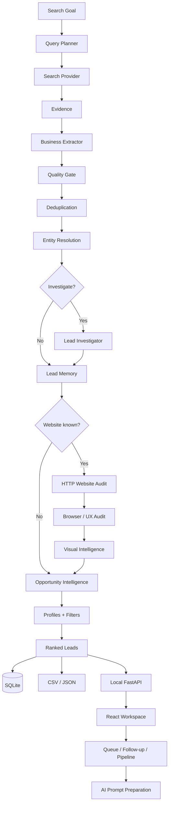

<div align="center">

# LeadFlow Agent

### Evidence-driven lead research, qualification and sales workflow for digital-service opportunities.

**Local-first · BYOK · Open source · Explainable scoring · Sales-oriented · Security-aware**


**Current version:** `v0.2.0-alpha.1` (`0.2.0a1` package version)

**Current focus:** `Phase 8.4.4 — Real-World Quality Validation` + operational sales workflow

</div>

---

## Table of contents

- [What is LeadFlow?](#what-is-leadflow)
- [Current product focus](#current-product-focus)
- [Project status](#project-status)
- [Sales workflow](#sales-workflow)
- [AI and prompt personalization](#ai-and-prompt-personalization)
- [Architecture](#architecture)
- [Intelligence layers](#intelligence-layers)
- [Installation](#installation)
- [Quick start](#quick-start)
- [Search profiles](#search-profiles)
- [Advanced filters](#advanced-filters)
- [Runtime safety](#runtime-safety)
- [Providers](#providers)
- [Security model](#security-model)
- [Testing](#testing)
- [Roadmap](#roadmap)
- [Product direction](#product-direction)

---

## What is LeadFlow?

LeadFlow is an open-source **lead research, qualification and opportunity intelligence application** designed to find real businesses, investigate them, verify evidence, audit their digital presence and explain **why a company may be a strong commercial opportunity**.

It has now expanded beyond discovery into a local-first sales workflow: persistent lead lifecycle, contact queue, batch queueing, follow-ups, sales pipeline, reusable prompts and AI-assisted preparation of site concepts, visual concepts and prototypes.

It is not a static lead database and it does not assume that one search result equals one company.

LeadFlow works more like a research analyst and sales workspace:

```text
Goal
  ↓
Plan search queries
  ↓
Search public evidence
  ↓
Extract real businesses
  ↓
Deduplicate + resolve identity
  ↓
Investigate uncertain data
  ↓
Audit website / browser UX / visual quality
  ↓
Classify opportunity
  ↓
Rank + explain + persist
  ↓
Manage lead lifecycle
  ↓
Queue contacts + follow-ups + sales stages
  ↓
Prepare proposals / concepts with AI
```

The project started from a practical problem: manually prospecting local businesses for web-development services one by one. The current product is therefore optimized first for **the operator who needs to find, contact and follow up with many potential clients without repeating the same manual work every day**.

> **Core safety rule:** false association is worse than missing information.

If LeadFlow is unsure whether a website, phone number or social profile really belongs to the intended company, it prefers to keep the field unresolved instead of attaching potentially wrong data.

---

## Current product focus

The current priority is no longer adding large infrastructure features. The immediate goal is to make the main workflow genuinely useful for daily prospecting:

```text
Find new businesses
      ↓
Qualify and verify
      ↓
Select promising leads
      ↓
Queue multiple contacts
      ↓
Work the queue manually
      ↓
Record what happened
      ↓
Schedule follow-ups
      ↓
Move opportunities through the sales pipeline
      ↓
Prepare proposal / site concept / visual concept / prototype
```

The application remains **manual-action oriented** for outreach. It can prepare and organize communication, but it does not silently send bulk messages on behalf of the user.

---

## Why LeadFlow is different

Traditional lead scrapers often optimize for quantity. LeadFlow is being built around **evidence quality, identity safety, commercial context and operational memory**.

| Traditional approach | LeadFlow |
|---|---|
| Search result = lead | Search result = evidence |
| Missing website = automatically good lead | Website state must be investigated |
| Same business name = same company | Identity requires corroborating evidence |
| One generic score | Separate identity, technical, UX, visual and opportunity signals |
| Re-search everything | Persistent cache + business memory + lifecycle |
| Provider failures crash the run | Retries, budgets, circuit breakers and partial completion |
| Fixed lead criteria | Search profiles + advanced filters |
| Forget what happened yesterday | Persistent contact, follow-up and sales state |
| Contact one lead at a time | Batch queue + operator workflow |
| One fixed AI workflow | Editable prompts + AI choice per task |

---

## Project status

LeadFlow is currently a **local-first alpha** with a functional React frontend and local FastAPI application layer. The **Backend Intelligence Core** is implemented, the operational sales workflow is in place, and the active engineering gate remains **Phase 8.4.4 — Real-World Quality Validation**.

The validation work exists to answer two separate questions:

1. **Can LeadFlow find enough relevant companies?**
2. **When it returns a lead, can the user trust the identity, contact route, website attribution and commercial opportunity?**

A request for 10 leads is treated as a real fulfillment target, but the application does not fabricate weak results merely to reach `10/10`. When the requested number cannot be reached safely, the UI exposes the partial result and the observed candidate/rejection counts.

### Implemented product capabilities

| Capability | Status |
|---|:---:|
| Search planning | ✅ |
| Web discovery | ✅ |
| Local/business discovery | ✅ |
| Structured business extraction | ✅ |
| Deduplication | ✅ |
| Conservative entity resolution | ✅ |
| Lead Investigator | ✅ |
| Persistent search cache | ✅ |
| Persistent lead memory | ✅ |
| Data-quality guardrails | ✅ |
| Website technical audit | ✅ |
| Browser / mobile UX audit | ✅ |
| Screenshot generation | ✅ |
| Multimodal visual intelligence | ✅ |
| Opportunity Intelligence | ✅ |
| Search profiles | ✅ |
| Advanced filters | ✅ |
| Runtime budgets | ✅ |
| Circuit breakers | ✅ |
| Cancellation | ✅ |
| Provider capability registry | ✅ |
| SQLite persistence + migrations | ✅ |
| Local FastAPI application API | ✅ |
| React/TypeScript frontend | ✅ Functional |
| Lead lifecycle | ✅ |
| Contact queue | ✅ |
| Batch queueing | ✅ |
| Manual operator mode | ✅ |
| Follow-ups | ✅ |
| Sales pipeline | ✅ |
| Restorable lead states | ✅ |
| Prompt personalization | ✅ |
| AI selection per task | ✅ |
| Site / visual / prototype prompt preparation | ✅ |
| Proposal workspace data | 🟡 In progress |
| Automated response detection | 🕒 Later |
| Cloud accounts / login | 🕒 Later |
| Billing / subscriptions | 🕒 Later |
| Automated outreach | 🕒 Later / controlled |
| Public beta packaging | 🕒 Later |

### Current automated regression baseline

```text
208 tests passing
```

This regression suite covers core research, provider adapters, identity, filters, runtime, lifecycle, settings, replay and Phase 8.4.x behavior.

---

## Sales workflow

The operational layer is designed around the daily prospecting loop rather than a traditional CRM-first model.

### Lead lifecycle

A lead can move through these states:

```text
NEW
 ↓
ACCEPTED
 ↓
QUEUED
 ↓
CONTACTED
 ↓
AWAITING_RESPONSE
 ↓
RESPONDED
 ↓
PROPOSAL_SENT
 ↓
NEGOTIATING
 ↓
WON / LOST
```

Operational states such as `IGNORED` and `HIDDEN` are also supported and remain reversible.

### Persistent contact queue

The queue supports:

- adding one lead or multiple selected leads;
- opening the next lead for manual contact;
- moving to previous/next items;
- marking a lead as contacted and advancing;
- skipping a lead without deleting it;
- keeping queue state in SQLite.

The queue is intentionally **not an automatic sender**. The user remains responsible for the final send action.

### Follow-ups

Follow-ups are stored against the lead, with a scheduled date/time and note. This makes the daily workflow explicit instead of relying on memory:

```text
Contacted
  ↓
Schedule follow-up
  ↓
Follow-up due
  ↓
Review
  ↓
Contact again / respond / propose / close
```

### Persistent memory between searches

LeadFlow keeps a local memory of businesses and their operational state so repeated searches can avoid recycling the same already-processed companies.

This allows the intended workflow:

```text
Monday    → find + contact new businesses
Tuesday   → search again → prioritize businesses not already processed
Wednesday → continue from the remaining pool
```

The goal is not to guarantee infinite unique leads; the system must still respect relevance, identity and quality constraints.

---

## AI and prompt personalization

The frontend includes a dedicated configuration area for personalizing the operator workflow.

### Editable message template

A global message template can be configured once and then reused across leads. Individual contact preparation can still override the template when needed.

### Editable AI prompts

Separate prompt templates are available for:

- site / copy concepts;
- visual/image concepts;
- prototype/site generation.

The prompts can use lead variables so the same template can be adapted to each company automatically.

### Supported prompt variables

```text
{{name}}
```

Public business name used for personalization.

```text
{{segment}}
```

Business segment/niche used in the search.

```text
{{city}}
```

Lead city.

```text
{{state}}
```

Lead state / UF.

```text
{{opportunity_type}}
```

Commercial opportunity inferred by LeadFlow, such as `NEW_SITE`, `REBUILD`, `REDESIGN` or `OPTIMIZATION`.

```text
{{lead_context}}
```

Consolidated lead context available to the prompt, including identity, evidence, contact and opportunity signals.

### AI selection

The application keeps AI selection task-specific rather than forcing one provider for everything. The operator can configure separate choices for text, images and prototype/site work.

LeadFlow does not require a single AI vendor for the entire sales workflow.

---

## Architecture



### Architectural principles

- **Evidence before assumptions** — external search data is treated as evidence, not truth.
- **Identity before enrichment** — a candidate field is not attached until it plausibly belongs to the same business.
- **Independent intelligence layers** — technical health, browser UX, visual quality and commercial opportunity remain separate.
- **Local-first** — research and sales state live locally in SQLite.
- **BYOK** — users bring their own provider credentials.
- **Bounded execution** — agents operate inside explicit runtime budgets.
- **Provider portability** — business logic depends on capabilities, not one vendor.
- **Reversible operations** — hiding, ignoring and other organizational actions should not silently destroy lead history.
- **Safe failure** — partial useful results are preferable to runaway retries or hard crashes.

---

## Intelligence layers

LeadFlow intentionally avoids collapsing everything into one misleading score.

### 1. Identity Confidence

Answers:

> **Are these details really about the same business?**

Identity states:

```text
UNVERIFIED
MATCHED
PROBABLE_MATCH
AMBIGUOUS
MISMATCH
```

Strong signals include normalized phone numbers, domains and consistent social/business evidence. Same name alone is not enough.

---

### 2. Website Technical Health

The HTTP auditor measures objective website signals such as:

- HTTP response status;
- HTTPS;
- redirects;
- response time;
- `<title>`;
- meta description;
- viewport configuration;
- forms;
- phone links;
- email links;
- WhatsApp links.

This produces a **technical score**, not an SEO score and not an aesthetic judgment.

---

### 3. Browser / UX Health

With the optional Playwright capability, LeadFlow opens the website in a real Chromium browser and can observe:

- mobile horizontal overflow;
- visible contact CTAs;
- WhatsApp / telephone actions;
- basic navigation presence;
- JavaScript/page errors;
- desktop rendering;
- mobile rendering;
- full-page screenshots.

This produces a deterministic **Browser UX score**.

---

### 4. Visual Quality

Desktop and mobile screenshots can optionally be reviewed by a multimodal model.

Visual Intelligence evaluates visible presentation dimensions such as:

- overall presentation;
- desktop quality;
- mobile quality;
- modernity;
- visual hierarchy;
- brand coherence;
- readability;
- visible conversion clarity;
- model confidence.

A visual score is **subjective AI-assisted analysis**. It cannot overwrite HTTP facts, identity evidence or browser measurements.

---

### 5. Opportunity Intelligence

LeadFlow converts verified evidence into an explainable commercial hypothesis.

Current opportunity types:

| Type | Meaning |
|---|---|
| `NEW_SITE` | No official website was identified after bounded investigation |
| `REBUILD` | Existing website has severe availability/technical problems |
| `REDESIGN` | Existing site works but shows strong modernization potential |
| `OPTIMIZATION` | Site has a reasonable base with visible improvement opportunities |
| `REVIEW_NEEDED` | More evidence or human review is required |
| `LOW_OPPORTUNITY` | Current evidence indicates weak fit for the selected goal |

LeadFlow also distinguishes:

```text
READY   → identity confidence is sufficient for action
VERIFY  → review identity/evidence before approaching the business
```

A company with a broken site may be a stronger commercial opportunity than a company with no site at all — but only when LeadFlow has enough confidence that the site really belongs to that company.

---

## Fulfillment and quality validation

If the operator requests `N` leads, LeadFlow attempts to return `N` **eligible** results, not merely `N` raw records.

The discovery stage tracks:

```text
requested
unique candidates
prequalified candidates
filter rejections
final returned leads
```

When the result is partial, the UI exposes the shortage rather than presenting a false success state.

### Phase 8.4.4 benchmark workflow

The benchmark harness lives in `benchmarks/` and `scripts/run_benchmark.py`.

```bash
python scripts/run_benchmark.py --list
python scripts/run_benchmark.py --case marcenaria-praia-grande-sp
```

The current official cases are:

```text
marcenaria / Praia Grande / SP
estetica automotiva / Santos / SP
vidracaria / Sao Vicente / SP
eletricista / Campinas / SP
moveis planejados / Sao Luis / MA
```

The quality gate measures fulfillment, precision, identity quality, phone plausibility, website attribution, contact usefulness, duplication, false merges, opportunity usefulness and usage/cost counters.

Manual truth is intentionally not generated by the software. Reviewers mark `PASS`, `FAIL` or `UNCERTAIN`.

### Fast validation loop

Full 10-lead provider runs are not the default validation tool for every patch.

```text
unit/regression tests
        ↓
fast capture / replay
        ↓
3-lead integration smoke
        ↓
10-lead official benchmark
```

Deterministic changes to ranking, lifecycle, filters or UI behavior can be validated without repeatedly consuming external provider calls.

---

## Requirements

### Core

- Python **3.11+**
- SQLite (included with Python)
- API keys only for the providers you choose to use

The core intentionally relies heavily on the Python standard library.

### Optional browser auditing

- Playwright
- Chromium runtime

### Frontend development

- Node.js / npm
- React 19
- TypeScript
- Vite

See `frontend/package.json` for the exact frontend dependency set.

---

## Installation

From the project directory:

### Windows

```bat
python -m venv .venv
.venv\Scripts\activate
python -m pip install --upgrade pip
python -m pip install -e .
```

For frontend development:

```bat
cd frontend
npm install
npm run dev
```

### Linux / macOS

```bash
python3 -m venv .venv
source .venv/bin/activate
python -m pip install --upgrade pip
python -m pip install -e .
```

For frontend development:

```bash
cd frontend
npm install
npm run dev
```

### Browser / UX capability

```bash
python -m pip install -e ".[browser]"
python -m playwright install chromium
```

Playwright is optional. Discovery, entity resolution, investigation, cache, memory and HTTP website auditing can run without it.

---

## Configuration

Run the interactive setup:

```bash
python -m leadflow_agent setup
```

Then verify the environment:

```bash
python -m leadflow_agent doctor
```

Typical provider configuration includes:

- Gemini API key;
- Gemini model;
- Tavily API key;
- optional Brave / Outscraper credentials;
- local SQLite path.

Development credentials are stored in a local `.env`, which must never be committed.

The frontend also has a dedicated local-first **Configurações** area for message templates, AI prompts and task-specific AI selection. Those settings are intended to be editable without changing source code.

> The future desktop build is planned to use the operating system credential vault/keyring instead of plain-text local configuration.

---

## Quick start

### Basic search

```bat
python -m leadflow_agent search --segment "marcenaria" --city "Praia Grande" --state SP --limit 10 --provider tavily
```

### Search + bounded investigation

```bat
python -m leadflow_agent search --segment "marcenaria" --city "Praia Grande" --state SP --limit 10 --provider tavily --investigate --investigation-limit 3 --investigation-budget 2
```

### Full website intelligence stack

```bat
python -m leadflow_agent search --segment "marcenaria" --city "Praia Grande" --state SP --limit 10 --provider tavily --investigate --investigation-limit 3 --investigation-budget 2 --audit-websites --audit-limit 3 --browser-audit --browser-audit-limit 3 --visual-audit --visual-audit-limit 3
```

### Local API

The local application API is served by FastAPI and binds to localhost for local use.

```bash
python -m leadflow_agent api
```

The React frontend can then use the local application API for search runs, lead lifecycle, queue, follow-ups and configuration.

---

## Search profiles

List profiles:

```bash
python -m leadflow_agent profiles
```

Current profiles include:

```text
balanced
website-sales
new-site
redesign
visual-redesign
ready-only
instagram-first
phone-first
```

Profiles are defaults. Advanced flags can override them.

---

## Advanced filters

LeadFlow supports filtering by:

- website state;
- Instagram presence;
- phone presence;
- email presence;
- `READY` / `VERIFY` state;
- opportunity type;
- minimum Opportunity Score;
- maximum technical score;
- maximum Browser UX score;
- maximum Visual Quality score;
- minimum visual confidence;
- presence of any usable contact channel.

When filters are restrictive, LeadFlow can build a larger candidate pool before filtering instead of pretending that the first `N` discovered businesses are valid matches.

---

## Runtime safety

LeadFlow uses bounded execution rather than open-ended autonomous loops.

Current controls include:

- explicit search/LLM/audit budgets;
- provider capability checks;
- retries with backoff for transient errors;
- circuit breakers;
- cancellation;
- partial-result reporting;
- conservative URL/SSRF-oriented checks for website auditing;
- prompts that treat web content as untrusted input.

The local application also keeps the API bound to localhost for local workflows.

---

## Providers

Current provider adapters include:

```text
Tavily      → web evidence
Brave       → web + local/business discovery
Outscraper  → local/business results
Gemini      → planning, extraction, investigation and optional visual analysis
```

Provider expansion is intentionally frozen until the real-world quality benchmark demonstrates an objective need.

---

## Security model

LeadFlow is designed around the following boundaries:

- secrets are not part of lead evidence;
- provider credentials should remain local and redacted from public output;
- web pages are treated as untrusted content;
- website auditing uses SSRF-oriented safety checks;
- browser auditing blocks private-network targets;
- local APIs use host/origin safeguards;
- lead identity is conservative by design;
- user actions remain explicit for outreach.

The application does **not** silently send outreach messages.

---

## Testing

Run the complete Python regression suite:

```bash
python -m unittest discover -s tests -q
```

Current baseline:

```text
208 tests passing
```

Frontend development should also run:

```bash
cd frontend
npm install
npm run typecheck
npm run build
```

The repository's Python regression suite is the currently verified automated baseline. Frontend build verification depends on the local Node/npm environment and installed dependencies.

---

## Roadmap

### Immediate — make daily prospecting faster and more complete

```text
✅ discovery + qualification
✅ persistent lead memory
✅ lifecycle
✅ contact queue
✅ batch queueing
✅ operator mode
✅ follow-ups
✅ sales pipeline
✅ prompt customization
✅ AI task selection
✅ interaction history

→ reusable message templates by situation
→ reusable message templates by situation
→ stronger proposal workspace
→ richer conversation / response states
→ better lead shortage explanations
→ conversion-oriented dashboard
```

### Next — commercial intelligence

```text
→ reusable message templates by situation
→ richer conversation / response states
→ stronger proposal workspace
→ proposal generation
→ richer concept/image/prototype workflows
→ reusable sales templates
→ campaign/search history
→ conversion metrics
→ learn which opportunity types convert best
```

### Later — distribution and scale

```text
→ frontend automated tests
→ React + FastAPI E2E tests
→ clean release build
→ secure credential storage
→ Windows onedir packaging
→ public beta
→ optional cloud/sync
```

The project intentionally avoids making cloud, billing, microservices or a full CRM prerequisites for the local v1 workflow.

---

## Product direction

The long-term goal is not to become another generic CRM or scraping dashboard.

LeadFlow is being shaped around one high-value workflow:

```text
Find
 ↓
Understand
 ↓
Qualify
 ↓
Contact
 ↓
Follow up
 ↓
Prepare proposal
 ↓
Create site/visual concept
 ↓
Negotiate
 ↓
Win
```

The software should remove repetitive manual work while keeping the final commercial decisions in the operator's hands.

The most important future metric is therefore not raw lead count. It is the efficiency and quality of the path from:

> **new business discovered → meaningful contact → proposal → sale.**

---

## License

MIT — see [`LICENSE`](LICENSE).

---

## Disclaimer

LeadFlow is a research and workflow tool. Search results, AI outputs and commercial classifications require human judgment. The application should not be treated as an authoritative source of business identity, legal status, contact ownership or guaranteed commercial intent.

### Raw Discovery / Leads brutos

A busca oferece dois modos:

- **Leads qualificados**: usa perfil, filtros, investigação e auditorias normalmente.
- **Leads brutos / sem filtros**: retorna candidatos descobertos do segmento/local para inspeção manual, sem aplicar os filtros comerciais do perfil e sem gastar recursos com investigação/auditorias profundas. Sanitização básica, deduplicação e exclusão de leads já presentes na biblioteca continuam ativas.

Use o modo bruto quando a intenção for explorar a cobertura do segmento ou avaliar manualmente empresas que normalmente seriam descartadas pelo workflow de qualificação.
